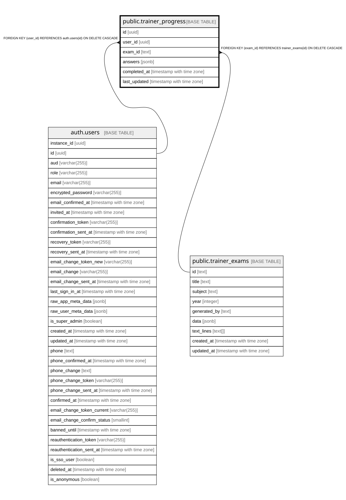

# public.trainer_progress

## Columns

| Name | Type | Default | Nullable | Children | Parents | Comment |
| ---- | ---- | ------- | -------- | -------- | ------- | ------- |
| id | uuid | gen_random_uuid() | false |  |  |  |
| user_id | uuid |  | false |  | [auth.users](auth.users.md) |  |
| exam_id | text |  | false |  | [public.trainer_exams](public.trainer_exams.md) |  |
| answers | jsonb | '{}'::jsonb | true |  |  |  |
| completed_at | timestamp with time zone |  | true |  |  |  |
| last_updated | timestamp with time zone | now() | true |  |  |  |

## Constraints

| Name | Type | Definition |
| ---- | ---- | ---------- |
| trainer_progress_user_id_fkey | FOREIGN KEY | FOREIGN KEY (user_id) REFERENCES auth.users(id) ON DELETE CASCADE |
| trainer_progress_exam_id_fkey | FOREIGN KEY | FOREIGN KEY (exam_id) REFERENCES trainer_exams(id) ON DELETE CASCADE |
| trainer_progress_pkey | PRIMARY KEY | PRIMARY KEY (id) |
| trainer_progress_user_id_exam_id_key | UNIQUE | UNIQUE (user_id, exam_id) |

## Indexes

| Name | Definition |
| ---- | ---------- |
| trainer_progress_pkey | CREATE UNIQUE INDEX trainer_progress_pkey ON public.trainer_progress USING btree (id) |
| trainer_progress_user_id_exam_id_key | CREATE UNIQUE INDEX trainer_progress_user_id_exam_id_key ON public.trainer_progress USING btree (user_id, exam_id) |
| idx_trainer_progress_exam | CREATE INDEX idx_trainer_progress_exam ON public.trainer_progress USING btree (exam_id) |
| idx_trainer_progress_user | CREATE INDEX idx_trainer_progress_user ON public.trainer_progress USING btree (user_id) |

## Triggers

| Name | Definition |
| ---- | ---------- |
| update_trainer_progress_updated_at | CREATE TRIGGER update_trainer_progress_updated_at BEFORE UPDATE ON public.trainer_progress FOR EACH ROW EXECUTE FUNCTION update_updated_at_column() |

## Relations

---

> Generated by [tbls](https://github.com/k1LoW/tbls)
