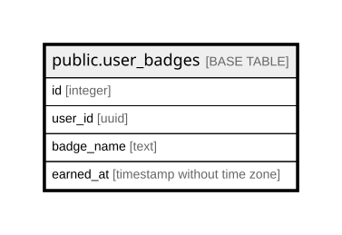

# public.user_badges

## Columns

| Name | Type | Default | Nullable | Children | Parents | Comment |
| ---- | ---- | ------- | -------- | -------- | ------- | ------- |
| id | integer | nextval('user_badges_id_seq'::regclass) | false |  |  |  |
| user_id | uuid |  | true |  |  |  |
| badge_name | text |  | false |  |  |  |
| earned_at | timestamp without time zone | now() | true |  |  |  |

## Constraints

| Name | Type | Definition |
| ---- | ---- | ---------- |
| unique_user_badge | UNIQUE | UNIQUE (user_id, badge_name) |
| user_badges_pkey | PRIMARY KEY | PRIMARY KEY (id) |

## Indexes

| Name | Definition |
| ---- | ---------- |
| unique_user_badge | CREATE UNIQUE INDEX unique_user_badge ON public.user_badges USING btree (user_id, badge_name) |
| user_badges_pkey | CREATE UNIQUE INDEX user_badges_pkey ON public.user_badges USING btree (id) |

## Relations

---

> Generated by [tbls](https://github.com/k1LoW/tbls)
