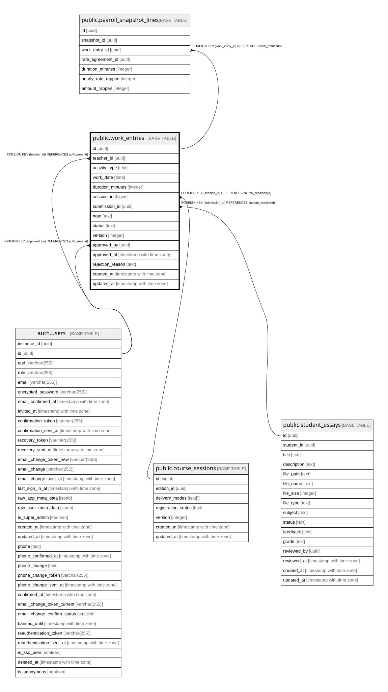

# public.work_entries

## Description

Geleistete Arbeitszeit (Schritt 10c, Abschnitt 2.14). Lehrpersonen verwalten nur eigene draft/rejected-Eintraege; Genehmigung/Zurueckweisung/Sperrung bleiben admin-only.

## Columns

| Name | Type | Default | Nullable | Children | Parents | Comment |
| ---- | ---- | ------- | -------- | -------- | ------- | ------- |
| id | uuid | gen_random_uuid() | false | [public.payroll_snapshot_lines](public.payroll_snapshot_lines.md) |  |  |
| teacher_id | uuid |  | false |  | [auth.users](auth.users.md) |  |
| activity_type | text |  | false |  |  |  |
| work_date | date |  | false |  |  |  |
| duration_minutes | integer |  | false |  |  |  |
| session_id | bigint |  | true |  | [public.course_sessions](public.course_sessions.md) |  |
| submission_id | uuid |  | true |  | [public.student_essays](public.student_essays.md) |  |
| note | text |  | true |  |  |  |
| status | text | 'draft'::text | false |  |  |  |
| version | integer | 1 | false |  |  |  |
| approved_by | uuid |  | true |  | [auth.users](auth.users.md) |  |
| approved_at | timestamp with time zone |  | true |  |  |  |
| rejection_reason | text |  | true |  |  |  |
| created_at | timestamp with time zone | now() | false |  |  |  |
| updated_at | timestamp with time zone | now() | false |  |  |  |

## Constraints

| Name | Type | Definition |
| ---- | ---- | ---------- |
| work_entries_activity_type_check | CHECK | CHECK ((activity_type = ANY (ARRAY['course_teaching'::text, 'exam_supervision'::text, 'essay_feedback'::text, 'coaching'::text, 'preparation'::text, 'administration'::text, 'other'::text]))) |
| work_entries_course_teaching_needs_session | CHECK | CHECK (((activity_type <> 'course_teaching'::text) OR (session_id IS NOT NULL))) |
| work_entries_duration_minutes_check | CHECK | CHECK ((duration_minutes > 0)) |
| work_entries_essay_feedback_needs_submission | CHECK | CHECK (((activity_type <> 'essay_feedback'::text) OR (submission_id IS NOT NULL))) |
| work_entries_source_exclusive | CHECK | CHECK ((NOT ((session_id IS NOT NULL) AND (submission_id IS NOT NULL)))) |
| work_entries_status_check | CHECK | CHECK ((status = ANY (ARRAY['draft'::text, 'submitted'::text, 'approved'::text, 'rejected'::text, 'locked'::text]))) |
| work_entries_approved_by_fkey | FOREIGN KEY | FOREIGN KEY (approved_by) REFERENCES auth.users(id) |
| work_entries_teacher_id_fkey | FOREIGN KEY | FOREIGN KEY (teacher_id) REFERENCES auth.users(id) |
| work_entries_submission_id_fkey | FOREIGN KEY | FOREIGN KEY (submission_id) REFERENCES student_essays(id) |
| work_entries_session_id_fkey | FOREIGN KEY | FOREIGN KEY (session_id) REFERENCES course_sessions(id) |
| work_entries_pkey | PRIMARY KEY | PRIMARY KEY (id) |
| work_entries_teacher_id_session_id_work_date_key | UNIQUE | UNIQUE (teacher_id, session_id, work_date) |

## Indexes

| Name | Definition |
| ---- | ---------- |
| work_entries_pkey | CREATE UNIQUE INDEX work_entries_pkey ON public.work_entries USING btree (id) |
| work_entries_teacher_id_session_id_work_date_key | CREATE UNIQUE INDEX work_entries_teacher_id_session_id_work_date_key ON public.work_entries USING btree (teacher_id, session_id, work_date) |
| idx_work_entries_teacher_id | CREATE INDEX idx_work_entries_teacher_id ON public.work_entries USING btree (teacher_id) |
| idx_work_entries_work_date | CREATE INDEX idx_work_entries_work_date ON public.work_entries USING btree (work_date) |
| idx_work_entries_status | CREATE INDEX idx_work_entries_status ON public.work_entries USING btree (status) |

## Triggers

| Name | Definition |
| ---- | ---------- |
| work_entries_bump_version | CREATE TRIGGER work_entries_bump_version BEFORE UPDATE ON public.work_entries FOR EACH ROW EXECUTE FUNCTION bump_version_and_updated_at() |
| work_entries_validate_transition | CREATE TRIGGER work_entries_validate_transition BEFORE UPDATE ON public.work_entries FOR EACH ROW EXECUTE FUNCTION validate_work_entry_status_transition() |

## Relations

---

> Generated by [tbls](https://github.com/k1LoW/tbls)
