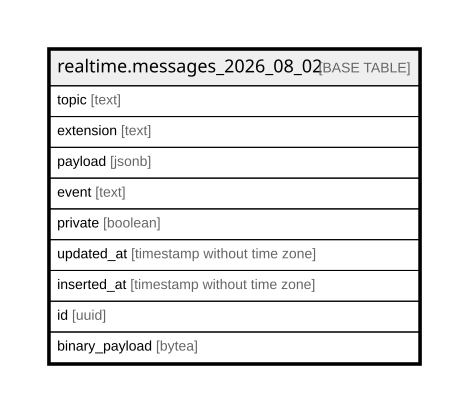

# realtime.messages_2026_08_02

## Columns

| Name | Type | Default | Nullable | Children | Parents | Comment |
| ---- | ---- | ------- | -------- | -------- | ------- | ------- |
| topic | text |  | false |  |  |  |
| extension | text |  | false |  |  |  |
| payload | jsonb |  | true |  |  |  |
| event | text |  | true |  |  |  |
| private | boolean | false | true |  |  |  |
| updated_at | timestamp without time zone | now() | false |  |  |  |
| inserted_at | timestamp without time zone | now() | false |  |  |  |
| id | uuid | gen_random_uuid() | false |  |  |  |
| binary_payload | bytea |  | true |  |  |  |

## Constraints

| Name | Type | Definition |
| ---- | ---- | ---------- |
| messages_payload_exclusive | CHECK | CHECK (((payload IS NULL) OR (binary_payload IS NULL))) |
| messages_2026_08_02_pkey | PRIMARY KEY | PRIMARY KEY (id, inserted_at) |

## Indexes

| Name | Definition |
| ---- | ---------- |
| messages_2026_08_02_pkey | CREATE UNIQUE INDEX messages_2026_08_02_pkey ON realtime.messages_2026_08_02 USING btree (id, inserted_at) |
| messages_2026_08_02_inserted_at_topic_idx | CREATE INDEX messages_2026_08_02_inserted_at_topic_idx ON realtime.messages_2026_08_02 USING btree (inserted_at DESC, topic) WHERE ((extension = 'broadcast'::text) AND (private IS TRUE)) |

## Relations

---

> Generated by [tbls](https://github.com/k1LoW/tbls)
