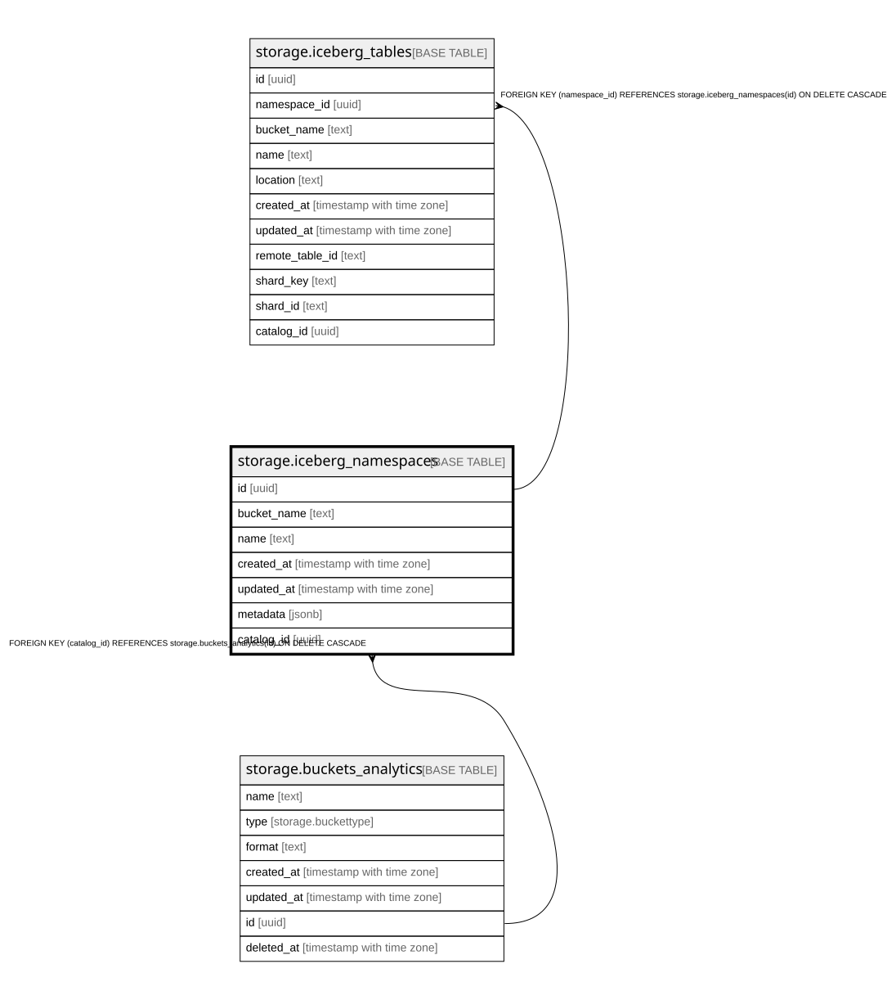

# storage.iceberg_namespaces

## Columns

| Name | Type | Default | Nullable | Children | Parents | Comment |
| ---- | ---- | ------- | -------- | -------- | ------- | ------- |
| id | uuid | gen_random_uuid() | false | [storage.iceberg_tables](storage.iceberg_tables.md) |  |  |
| bucket_name | text |  | false |  |  |  |
| name | text |  | false |  |  |  |
| created_at | timestamp with time zone | now() | false |  |  |  |
| updated_at | timestamp with time zone | now() | false |  |  |  |
| metadata | jsonb | '{}'::jsonb | false |  |  |  |
| catalog_id | uuid |  | false |  | [storage.buckets_analytics](storage.buckets_analytics.md) |  |

## Constraints

| Name | Type | Definition |
| ---- | ---- | ---------- |
| iceberg_namespaces_pkey | PRIMARY KEY | PRIMARY KEY (id) |
| iceberg_namespaces_catalog_id_fkey | FOREIGN KEY | FOREIGN KEY (catalog_id) REFERENCES storage.buckets_analytics(id) ON DELETE CASCADE |

## Indexes

| Name | Definition |
| ---- | ---------- |
| iceberg_namespaces_pkey | CREATE UNIQUE INDEX iceberg_namespaces_pkey ON storage.iceberg_namespaces USING btree (id) |
| idx_iceberg_namespaces_bucket_id | CREATE UNIQUE INDEX idx_iceberg_namespaces_bucket_id ON storage.iceberg_namespaces USING btree (catalog_id, name) |

## Relations

---

> Generated by [tbls](https://github.com/k1LoW/tbls)
